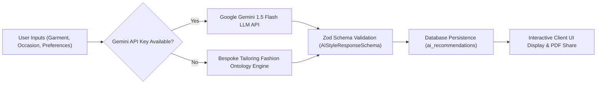

# 🤖 TAILORHUB AI — BESPOKE STYLE ASSISTANT ARCHITECTURE

**Module:** `backend/src/services/aiStyleService.ts` & `frontend/src/components/AIStyleAssistant.tsx`  
**Primary Engine:** Google Gemini 1.5 Flash / Pro API with Structured JSON Schema Validation  
**Fallback Engine:** Comprehensive Indian & Western Bespoke Fashion Ontology Rule Engine

---

## 🎨 1. Architecture & Design Principles

The TailorHub AI Style Assistant is tailored for custom garment construction, offering actionable advice on collar styles, sleeve cuffs, fabric pairings, and accessorization based on the customer's occasion and body profile.



---

## 📐 2. Zod Runtime Schema Validation

To guarantee zero hallucinated or malformed responses, every AI generation is validated against a strict Zod schema:

```typescript
export const AIStyleResponseSchema = z.object({
  title: z.string().min(3),
  neck_design: z.string().min(3),
  sleeve_design: z.string().min(3),
  pattern_suggestion: z.string().min(3),
  color_combination: z.string().min(3),
  occasion_suitability: z.string().min(3),
  styling_tips: z.array(z.string()).min(1)
});
```

---

## 🧵 3. Fashion Knowledge Base & Ontologies

The fallback ontology covers four primary bespoke categories:
1. **Ethnic & Heritage (Kurtas, Sherwanis, Nehru Jackets):** Bandhgala cuts, Mandarin collars with zari piping, asymmetric plackets, churidar pairings.
2. **Women's Designer Wear (Blouses, Lehengas, Salwar Suits):** Deep U/V necks, potli buttons, elbow sleeves with gold scalloped borders, princess darting.
3. **Formal & Executive (Suits, Blazers, Tuxedos):** 3.25-inch Notch & Peak lapels, kissing horn buttons, double vents, Super 120s wool blends.
4. **Casual & Smart Bespoke (Linen & Cotton Shirts):** Semi-spread cutaways, French cuffs, split back yokes, pentagonal gusset reinforcements.
