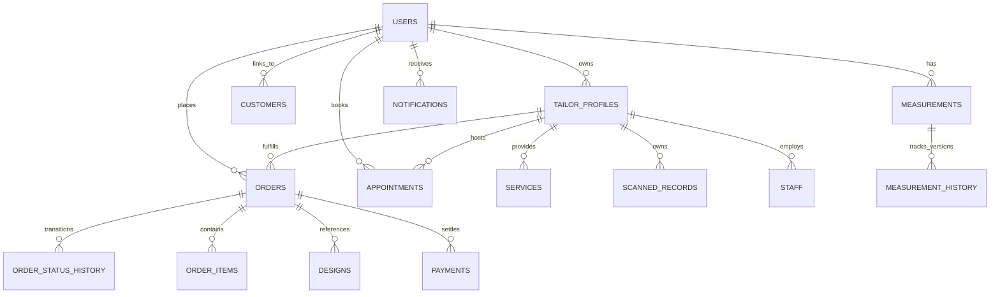

# 🗄️ TAILORHUB — DATABASE ARCHITECTURE & SCHEMA SPECIFICATION

**Database Management System:** PostgreSQL 15+ (Production) / SQLite3 (Local Development)  
**ORM / Query Engine:** Native Connection Pooling with Parameterized Queries & ACID Transactions  
**Spatial Capabilities:** PostGIS / Lat-Long Coordinates for Geolocation-based Tailor Discovery

---

## 📑 1. Entity-Relationship Model



---

## 🏗️ 2. Core Tables Schema

### 2.1 `users`
| Column | Type | Constraints | Description |
| :--- | :--- | :--- | :--- |
| `id` | `VARCHAR(64)` | `PRIMARY KEY` | Unique User UUID |
| `name` | `VARCHAR(255)` | `NOT NULL` | Full Name |
| `email` | `VARCHAR(255)` | `UNIQUE NOT NULL` | Email Address |
| `phone` | `VARCHAR(32)` | `NOT NULL` | 10-digit Phone Number |
| `role` | `VARCHAR(32)` | `CHECK(role IN (...))` | `CUSTOMER`, `TAILOR`, `STAFF`, `SHOP_MANAGER`, `ADMIN` |
| `language` | `VARCHAR(8)` | `DEFAULT 'en'` | Language (`en`, `te`, `hi`) |
| `profile_image` | `TEXT` | `NULL` | Avatar URL |
| `location` | `VARCHAR(255)` | `NULL` | City / Region |
| `password_hash` | `TEXT` | `NOT NULL` | Bcrypt / Argon2 Password Hash |
| `created_at` | `TIMESTAMPTZ` | `DEFAULT CURRENT_TIMESTAMP` | Account Creation Timestamp |

### 2.2 `tailor_profiles`
| Column | Type | Constraints | Description |
| :--- | :--- | :--- | :--- |
| `id` | `VARCHAR(64)` | `PRIMARY KEY` | Shop Profile UUID |
| `user_id` | `VARCHAR(64)` | `UNIQUE FK(users.id)` | Tailor User Reference |
| `shop_name` | `VARCHAR(255)` | `NOT NULL` | Registered Boutique / Shop Name |
| `description` | `TEXT` | `NULL` | Business Overview & Experience |
| `address` | `TEXT` | `NOT NULL` | Physical Shop Address |
| `latitude` | `DOUBLE PRECISION` | `NOT NULL` | GPS Latitude |
| `longitude` | `DOUBLE PRECISION` | `NOT NULL` | GPS Longitude |
| `rating` | `REAL` | `DEFAULT 5.0` | Aggregated Customer Rating |
| `review_count` | `INTEGER` | `DEFAULT 0` | Verified Review Count |
| `starting_price`| `DECIMAL(10,2)` | `DEFAULT 350.00` | Minimum Stitching Price |
| `shop_images` | `JSONB / TEXT` | `DEFAULT '[]'` | Portfolio Image URLs |
| `categories` | `JSONB / TEXT` | `DEFAULT '[]'` | Specialization Tags |

### 2.3 `measurements` & `measurement_history`
| Column | Type | Constraints | Description |
| :--- | :--- | :--- | :--- |
| `id` | `VARCHAR(64)` | `PRIMARY KEY` | Measurement Profile UUID |
| `customer_id` | `VARCHAR(64)` | `FK(users.id)` | Customer Owner |
| `profile_name` | `VARCHAR(128)` | `NOT NULL` | e.g. "Slim Formal Shirt" |
| `garment_category`| `VARCHAR(64)` | `NOT NULL` | `Shirt`, `Pant`, `Kurta`, `Blouse`, `Suit` |
| `measurement_data`| `JSONB / TEXT` | `NOT NULL` | Upper/Lower body measurement coordinates |
| `source` | `VARCHAR(32)` | `DEFAULT 'MANUAL'` | `MANUAL`, `SCANNED_RECORD`, `CUSTOMER_ENTERED` |
| `version` | `INTEGER` | `DEFAULT 1` | Incremental version number |
| `is_default` | `INTEGER / BOOLEAN`| `DEFAULT 0` | Default profile flag |

### 2.4 `orders` & `order_status_history`
| Column | Type | Constraints | Description |
| :--- | :--- | :--- | :--- |
| `id` | `VARCHAR(64)` | `PRIMARY KEY` | Order UUID |
| `order_number` | `VARCHAR(64)` | `UNIQUE NOT NULL` | Human Readable ID (e.g. `TH-2026-847291`) |
| `customer_id` | `VARCHAR(64)` | `FK(users.id)` | Client Placing Order |
| `tailor_id` | `VARCHAR(64)` | `FK(tailor_profiles.id)`| Fulfilling Tailor / Shop |
| `garment_type` | `VARCHAR(128)` | `NOT NULL` | Garment Style |
| `measurement_id`| `VARCHAR(64)` | `FK(measurements.id)`| Locked Measurement Snapshot |
| `status` | `VARCHAR(32)` | `NOT NULL` | 11-Stage Workflow State |
| `fabric_option` | `VARCHAR(32)` | `NOT NULL` | `CUSTOMER_PROVIDED` or `TAILOR_PROVIDED` |
| `total_amount` | `DECIMAL(10,2)` | `NOT NULL` | Total Order Price (INR) |
| `advance_amount`| `DECIMAL(10,2)` | `DEFAULT 0.00` | Advance Paid (INR) |
| `balance_amount`| `DECIMAL(10,2)` | `NOT NULL` | Remaining Unpaid Balance |
| `delivery_date` | `VARCHAR(32)` | `NOT NULL` | Target Handover Date |

### 2.5 `staff`
| Column | Type | Constraints | Description |
| :--- | :--- | :--- | :--- |
| `id` | `VARCHAR(64)` | `PRIMARY KEY` | Staff UUID |
| `tailor_id` | `VARCHAR(64)` | `FK(tailor_profiles.id)`| Boutique Shop ID |
| `name` | `VARCHAR(255)` | `NOT NULL` | Staff Member Name |
| `phone` | `VARCHAR(32)` | `NOT NULL` | Contact Number |
| `email` | `VARCHAR(255)` | `NULL` | Staff Email |
| `role` | `VARCHAR(32)` | `NOT NULL` | `MASTER_TAILOR`, `CUTTER`, `STITCHER`, `FINISHER`, `QC`, `SALES`, `SHOP_MANAGER` |
| `is_active` | `INTEGER / BOOLEAN`| `DEFAULT 1` | Active Status Flag |

---

## ⚡ 3. Performance & Indexing Strategy

```sql
-- Composite and Foreign Key Indices
CREATE INDEX idx_users_email ON users(email);
CREATE INDEX idx_users_phone ON users(phone);
CREATE INDEX idx_orders_number ON orders(order_number);
CREATE INDEX idx_orders_customer ON orders(customer_id);
CREATE INDEX idx_orders_tailor ON orders(tailor_id);
CREATE INDEX idx_staff_tailor ON staff(tailor_id);
CREATE INDEX idx_appointments_tailor ON appointments(tailor_id, date);
CREATE INDEX idx_notifications_user ON notifications(user_id, is_read);
CREATE INDEX idx_messages_order ON messages(order_id);
CREATE INDEX idx_scanned_tailor ON scanned_records(tailor_id);
CREATE INDEX idx_hist_orders_cust ON historical_orders(customer_id);
```
