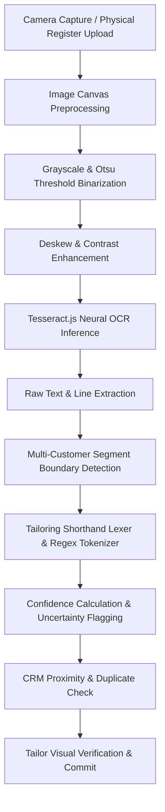

# 📸 TAILORHUB LENS — COMPUTER VISION & OCR DIGITIZATION PIPELINE

**Module:** `backend/src/services/lensOcrService.ts` & `frontend/src/components/OldRecordScanner.tsx`  
**Underlying Vision Engine:** Tesseract.js Neural Optical Character Recognition v5.0 + Intelligent Shorthand Lexer

---

## 🔍 1. Computer Vision Processing Pipeline

---

## ✂️ 2. Tailoring Shorthand Lexicon & Grammar

Indian and bespoke tailors employ specialized abbreviations when noting client measurements in physical books. TailorHub Lens includes an active domain grammar supporting:

| Shorthand Token | Target Body Measurement | Example Notation | Parsed Value |
| :--- | :--- | :--- | :--- |
| `Ch`, `C`, `Chest` | Upper Body Chest | `Ch: 40`, `Ch 40.5` | `chest: 40` |
| `W`, `Waist` | Upper/Lower Body Waist | `W: 34`, `W-34` | `waist: 34` |
| `Sh`, `Shoulder` | Shoulder Width | `Sh: 18.5`, `Sh 19` | `shoulder: 18.5` |
| `Slv`, `SL`, `Sleeve` | Sleeve Length | `Slv: 25`, `SL 24.5` | `sleeve: 25` |
| `N`, `Nk`, `Neck` | Collar / Neck Circumference | `N: 16`, `Neck 16.5` | `neck: 16` |
| `AH`, `Armhole` | Armhole Circumference | `AH: 19`, `Armhole 19.5` | `armhole: 19` |
| `L`, `Len`, `Length` | Shirt / Kurta Length | `L: 29.5`, `Length 40` | `shirt_length: 29.5` |
| `H`, `Hip` | Lower Body Hip | `H: 40`, `Hip 42` | `hip: 40` |
| `Th`, `Thigh` | Thigh Circumference | `Th: 24`, `Thigh 25` | `thigh: 24` |
| `Kn`, `Knee` | Knee Circumference | `Kn: 18`, `Knee 18.5` | `knee: 18` |
| `B`, `Bot`, `Bottom` | Pant / Trouser Bottom Hem | `B: 16`, `Bottom 15.5` | `bottom: 16` |
| `PL`, `Pant L` | Total Pant Length | `PL: 41`, `Pant L: 40` | `pant_length: 41` |
| `Adv`, `Bal`, `Rate` | Financial Figures | `Rate 1600 Adv 1000 Bal 600` | `price: 1600, advance: 1000, balance: 600` |

---

## 🎯 3. Multi-Customer Ledger Segmentation

Tailor register books often contain 2 to 4 customer records per page separated by horizontal pen strokes or numbering.
- **Divider Detection:** Evaluates horizontal rules (`-----`, `=====`) and numbering prefixes (`Customer 1:`, `Cust 2:`, `Sri...`).
- **Isolation:** Extracts distinct candidates, each with an independent set of measurements, prices, dates, and confidence values.
- **Uncertainty Guard:** Values with OCR confidence `< 0.70` or containing `?` are highlighted in yellow on the tailor verification UI for manual confirmation before committing to the customer database.
