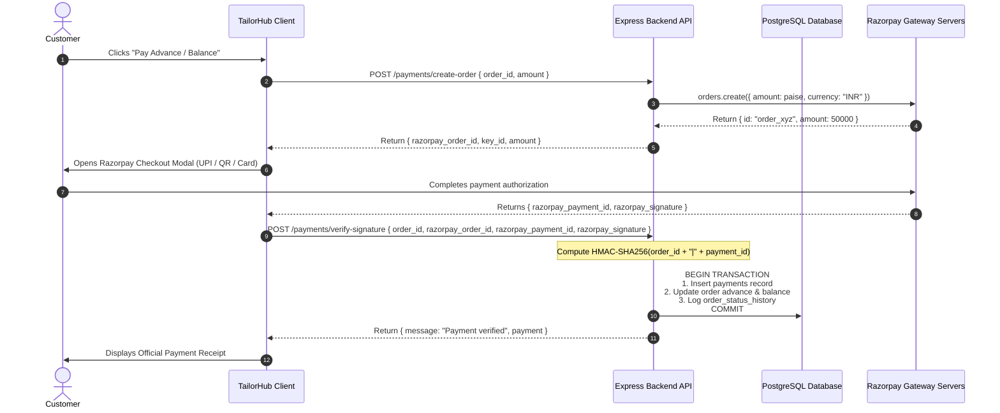

# 💳 TAILORHUB — RAZORPAY PAYMENTS & TRANSACTION RECONCILIATION

**Module:** `backend/src/services/paymentService.ts` & `frontend/src/components/PaymentModal.tsx`  
**Payment Gateway:** Razorpay Node.js SDK (INR Currency, UPI, Cards, NetBanking)  
**Security Standard:** HMAC-SHA256 Cryptographic Signature Verification

---

## 🔄 1. Complete Payment Transaction Lifecycle



---

## 🔒 2. Cryptographic Signature Verification

To prevent client-side tampering, signatures are re-computed server-side using the private `RAZORPAY_KEY_SECRET`:

```typescript
const generatedSignature = crypto
  .createHmac('sha256', process.env.RAZORPAY_KEY_SECRET)
  .update(`${razorpayOrderId}|${razorpayPaymentId}`)
  .digest('hex');

if (generatedSignature !== razorpaySignature) {
  throw new Error('Invalid payment signature. Verification failed.');
}
```

---

## 🗃️ 3. Atomic Financial Reconciliation

Financial updates are wrapped in an ACID transaction:
1. **Insert Payment:** Writes immutable row to `payments` table.
2. **Recompute Balance:** Reads `total_amount`, adds new payment to `advance_amount`, recalculates `balance_amount = total_amount - advance_amount`.
3. **Audit Trail:** Records entry in `order_status_history` noting transaction ID and timestamp.
4. **WebSocket Push:** Broadcasts `PAYMENT_RECEIVED` to tailor studio in real time.
